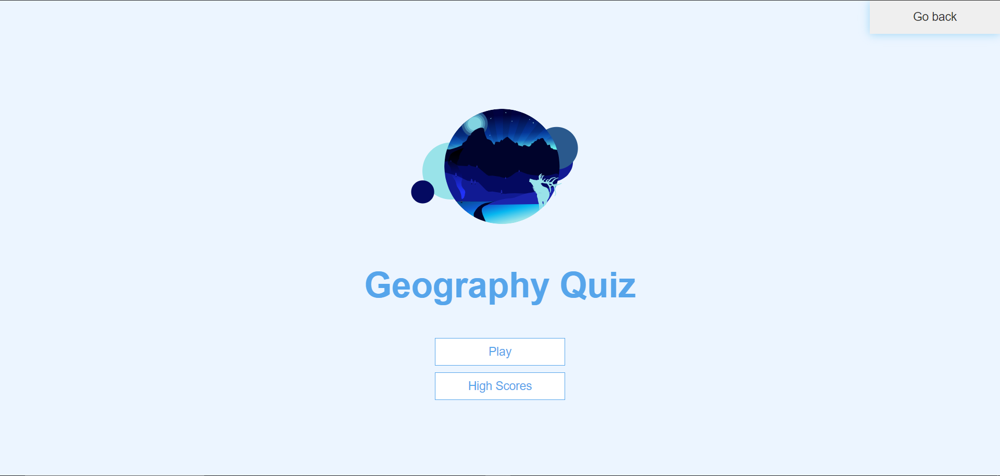

<!-- PROJECT LOGO -->
<br/>
<p align="center">
  <a href="https://github.com/tayyikyong/ID-Assignment-3-final-">
    
  </a>

  <h3 align="center">Astro Weather</h3>

  <p align="center">
    Astro Weather, the world's most reliable weather website.
    <br />
    <a href="https://github.com/tayyikyong/ID-Assignment-3-final-"><strong>Explore the docs »</strong></a>
  </p>
</p>


<!-- TABLE OF CONTENTS -->
<details open="open">
  <summary><h2 style="display: inline-block">Table of Contents</h2></summary>
  <ol>
    <li>
      <a href="#about-the-project">About The Project</a>
      <ul>
        <li><a href="#built-with">Built With</a></li>
      </ul>
    </li>
    <li>
      <a href="#getting-started">Getting Started</a>
      <ul>
        <li><a href="#installation">Installation</a></li>
      </ul>
    </li>
    <li><a href="#design process">Design Process</a></li>
    <li><a href="#usage">Usage</a></li>
    <li><a href="#techniques">Techniques</a></li>
    <li><a href="#My Commits">Commits</a></li>
    <li><a href="#Testing">Testing</a></li>
    <li><a href="#contact">Contact</a></li>
    <li><a href="#acknowledgements">Acknowledgements</a></li>
  </ol>
</details>


<!-- ABOUT THE PROJECT -->
## About The Project


Astro Weather is a weather website. It informs the user of the global weather upon entering the preferred country into the searchbar. 
Astro Weather was made to observe and understand the weather and climate around the world. 
The key areas of our website is to collect and maintain reliable long term global weather records and to provide reliable weather and climate services.


### Built With

* Visual Studio Code
1. HTML
   - HTML was used for the Home page, About page, Quiz page and contact page to place the content in the website.
1. CSS 
   - CSS was used for the Home page, About page, Quiz page and contact page to organise the layout and to design it.
2. JavaScript
   - JavaScript was used in the project to fetch the Weather api and to handle the form when searching.
* GitHub
* Lottie
  - Lottie was used in the project to make the website more aesthetically appealing.


<!-- GETTING STARTED -->
## Getting Started

To get a local copy up and running follow these simple steps.

### Installation

1. Clone the repo
   ```sh
   git clone https://github.com/tayyikyong/ID-Assignment-3-final-.git
   ```
2. Install NPM packages
   ```sh
   npm install
   ```

## Design Process
We designed the website to be user friendly, including a contact page for them if they have any enquires. Following a colour scheme of Blue which is the colour which calms people psychologically, it is also the colour used to represent the sky and the seas. Designing the quiz to be fun and an enriching experience for users to kill time or even allow them to broaden their horizons on geography.

<!-- USAGE EXAMPLES -->
## Usage

Before entering the home page, there will be a loading screen displaying a lottie, after 10 seconds, it will redirect the user to the home page.

The home page will consist of a navigation bar with lotties at the top which will be collapsible when the screen becomes smaller. In the middle of the home page, there will be the search bar 
with the display of the country that the user wants to search for. The background is unique to each country searched and it it is with relevance to the country. It will either be a popular landmark or place.

The weather website will also allow the user to search for specific areas in the different countries to determine the weather there. This will be helpful to the user as not all countries are small like Singapore hence, it will be helpful to know the weather in different locations.

There is also a quiz which users can partake in to test their geographical knowledge.


### Techniques
1. Creating a score system using __localstorage__
```javascript
incrementScore = (num) => {
    score += num;
    scoreText.innerText = score;
};
```
```javascript
const highScoresList = document.getElementById("highScoresList");
const highScores = JSON.parse(localStorage.getItem("highScores")) || [];

highScoresList.innerHTML = highScores
  .map(score => {
    return `<li class="high-score">${score.name} - ${score.score}</li>`;
  })
  .join("");
```

2. Retrieving from TriviaAPI
Retrieving the information from TriviaAPI using __fetch__
  * easy, logical way to fetch resources asynchronously across the network
  * Fetch provides a better alternative than `XMLHttpRequests` that can be easily used by other technologies such as `Service Workers`
  

```javascript
fetch(
    'https://opentdb.com/api.php?amount=10&category=22&difficulty=medium&type=multiple'
)
    .then((res) => {
        return res.json();
    })
    .then((loadedQuestions) => {
        questions = loadedQuestions.results.map((loadedQuestion) => {
            const formattedQuestion = {
                question: loadedQuestion.question,
            };

            const answerChoices = [...loadedQuestion.incorrect_answers];
            formattedQuestion.answer = Math.floor(Math.random() * 4) + 1;
            answerChoices.splice(
                formattedQuestion.answer - 1,
                0,
                loadedQuestion.correct_answer
            );

            answerChoices.forEach((choice, index) => {
                formattedQuestion['choice' + (index + 1)] = choice;
            });

            return formattedQuestion;
        });

        startGame();
    })
    .catch((err) => {
        console.error(err);
    });
```
## My Commits
[Commit List](https://github.com/tayyikyong/ID_Astro-Weather_website/commits/main)
1. Quiz
* Landing Page for quiz
* JS code for quiz
* Scoreboard for quiz
2. Temperature Site
* 

## Contact

Email - s10185009@connect.np.edu.sg
      - s10206047@connect.np.edu.sg

Project Link: [https://tayyikyong.github.io/ID_Astro-Weather_website/](https://tayyikyong.github.io/ID_Astro-Weather_website/)

## Testing
1. Searchbar
* When the user leaves the search box empty when searching, the website will display a relevant error message.
* When the user types in an irrelevant country or location, the website will display a relevant error message.
2. Quiz
* When user does not enter a name, score cannot be saved.

<!-- ACKNOWLEDGEMENTS -->
## Acknowledgements

1. Media
* [Tree gif](https://www.google.com/url?sa=i&url=https%3A%2F%2Fdribbble.com%2Fshots%2F1232960-Tree-Of-Seasons-GIF&psig=AOvVaw0fZnMqYmBdpU61Y6aZpm4u&ust=1613730142881000&source=images&cd=vfe&ved=0CAIQjRxqFwoTCNCdlbGb8-4CFQAAAAAdAAAAABAD)(Contact page)
* [Rain gif](https://giphy.com/gifs/rainy-raindrops-rainfall-vLi3T5m3RH45y)(About page)
* [Background images for home page](https://source.unsplash.com/1600x900/?landscape)
* [Lotties](https://lottiefiles.com/)

2. API
* [Trivia API](https://opentdb.com/api_config.php)

3. Inspiration
* [Quiz HTML](https://www.youtube.com/watch?v=rFWbAj40JrQ)

